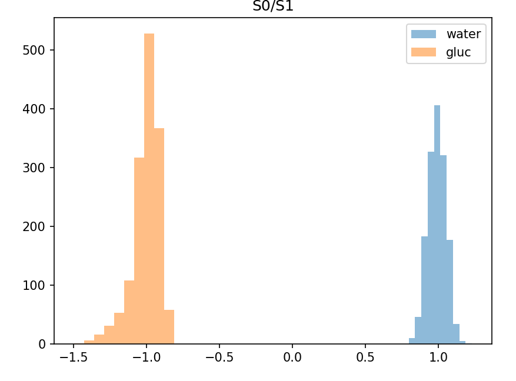
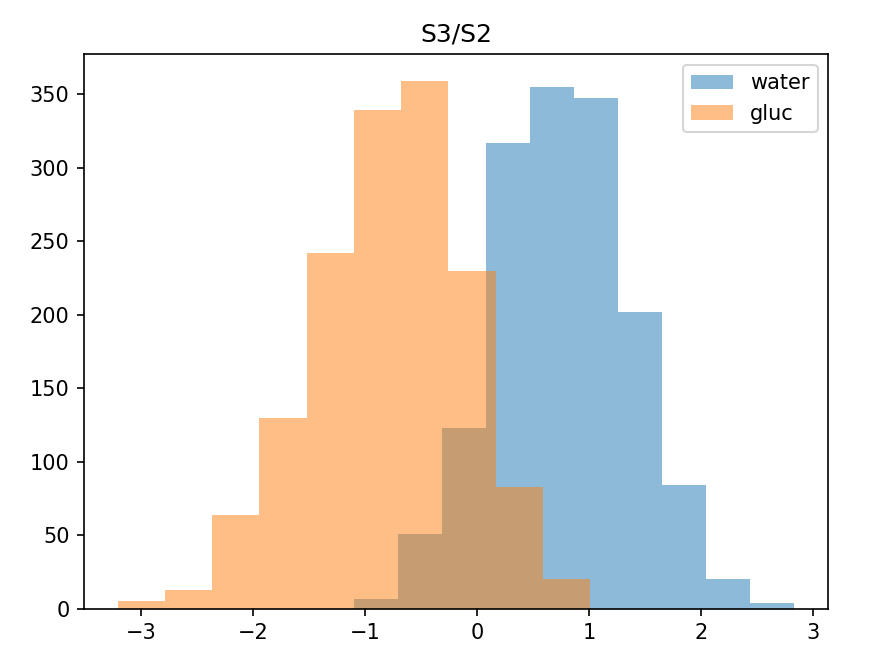

**Kansio raw** - mittaukset otettu käyttäämällä isompaa laatikkoa (syvyyttä enemmän mitä ensimmäisessä laatikon versiossa). Mittauksia kahdesta eri nesteestä, puhtaasta vedestä sekä glykoosilioksesta. Tässä mittauksessa käytetty jo vahvempaa liuosta, jossa konsentraatio 10mmol/ml.

DNN opetuksessa jätetty absoluuttiset arvot kokonaan pois ja käytetty ainoastaan featureita jotka saatu jakaamalla kaikki raaka-arvat toisilla raaka-arvoilla (S0/S1, S0/S2 jne), näin saatu yhteensä 12 saraketta lähtödataa. DNN tarkkuus testidatalla menee tuttuun tapaan saman tien 100%:iin. Ottaen huomioon että tässä on käytetty raaka-arvojen sijaan jako-arvoja ei ole tämä vältämättä huono asia.
Testidatan tarkkuus pysyy korkeana vaikka opetusdataan on lisätty kohinaa. Esim noiseAmount=2 päästään vielä 95% tarkkuudeen. (noiseAmount=2 tarkoittaa että jokaiselle koulutusdatassa olevalle arvolle lisätään uniformisesti satunnainen arvo väliltä -noiseAmout * sarakkeen_std ... noiseAmount * sarakkeen_std)

Tarkistamalla neuroverkkoon sisään menevää dataa huomataan että jotkut featuret erottaa aika hyvin veden sokerilioksesta. Esim alla on kuva jossa histogrammina S0/S1 arvot veden ja sokeriliuksen mittauksissa (noiseAmount 0):

Kaikki featuret eivät kuitenkaan ole näin erottelevia, esim S3/S2 arvoissa on kohtalaista päällekkäisyyttä:

Joululoman jälkeen onkin mielenkiintoista käyttää ko datalla koulutettua mallia reaaliajassa.