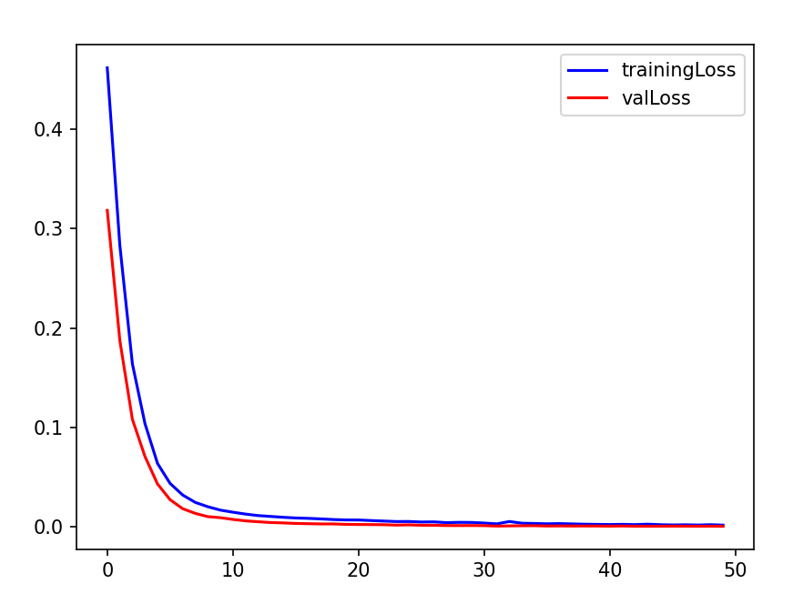

# 19.11.2025

**HumanData.csv** failissa on git:sta [sennoprojekti/SENNOmeasurement/inputData](https://github.com/Sennoharjoittelu/sennoprojekti/tree/main/SENNOmeasurement/inputData) human ja nothuman kansioissa olevat measurement csv failit kasattu yhteen tiedostoon. Y sarakkeessä 1 indikoi human:ia ja 0 nothuman:ia. On poistettu sarakkeet joiden arvot ovat pysyvästi 0 (esim 'S0-value1')

**dnn.py** failissa on malli jossa em dataa käytetään DNN kouluttamiseen. Mallin ylikouluttaminen ei onnistuu homogeenisen ja  hyvin korreloivan datan johdosta. Mikäli testX täytetään satunnaisarvoilla tai kouluttamiseen käytetään erittäin pientä osuutta datasta onnistuu ylikouluttaminen odotetusti.

Alla olevassa kuvassa näkyy  human (Y sarakkeessa 1) ja nothuman esimerkki sampleita. Huomataan että jotkut sarakkeet (esim S1-value2 ja S2-value2) indikoi aika hyvin onko kyseessä human vai not human. DNN siis ennustaa 100% tarkkuudella onko kyseessä human vai notHuman.

Alla olevassa korrelaatiotaulukossakin näkyy että useammat sarakkeet (kuten just S1-value2 ja S2-value2) korreloi kohtalaisen hyvin Y arvon kanssa. Mikäli korrelaatio on sen verran selvä/välitön ei vältämättä tarvitsee neuroverkkoa vaan saisi käyttää myös sklearn classifiereita.

Data todennäköisesti tulee olemaan heterogeenisempi kun aletaan ottamaan mittauksia biologisesta kudoksesta.