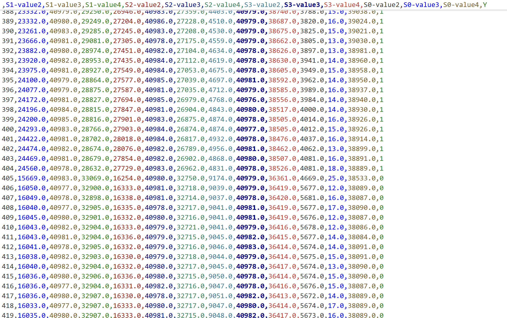
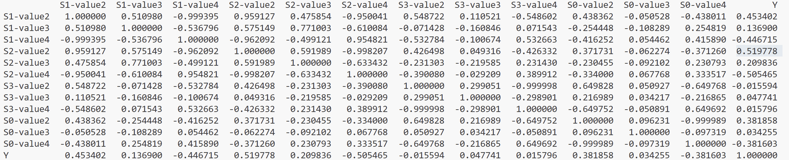

# Oppari 19.11.2025

dfAll.csv failissa on git:sta sennoprojekti/SENNOmeasurement/inputData human ja nothuman kansioissa olevat measurement csv failit kasattu yhteen failiin. Y sarakkeessä 1 indikoi human:ia ja 0 nothuman:ia. On poistettu sarakkeet joiden arvot ovat pysyvätsti 0 (esim 'S0-value1')

dnn.py failissa on malli jossa em dataa käytetään kouluttamiseen. Mallin ylikouluttaminen ei onnistuu hyvin homogeenisen datan johdosta. Alla olevassa kuvassa näkyy  human (Y sarakkeessa 1) ja nothuman esimerkki sampleita. Huomataan että jotkut sarakkeet (esim S1-value2 ja S2-value2) indikoi aika hyvin onko kyseess
 human vai not human. Siksi mallin ylikouluttaminen ei onnistuu. Mikäli testX täytetään satunnaisarvoilla onnistuu ylikouluttaminen odotetusti.

Alla olevassa korrelaatiotaulukossakin näkyy että S1-value 2 ja S2-value2 korreloi kohtalaisen hyvin Y arvon kanssa. Mikäli korrelaatio on sen verran selvä/välitön ei vältämätä tarvitsee neuroverkkoa vaan saa käyttää myös sklearn classifiereita.

Data todennäköisesti tulee olemaan heterogeenisempi kun aletaan ottamaan mittauksia biologisesta kudoksesta.