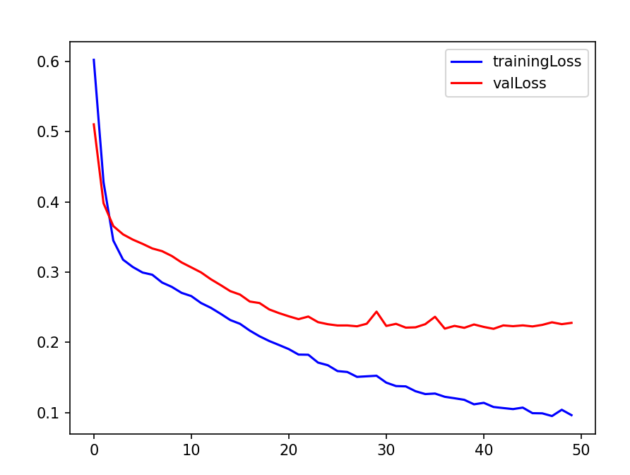

# 19.11.2025

**dfAll.csv** failissa on git:sta [sennoprojekti/SENNOmeasurement/inputData](https://github.com/Sennoharjoittelu/sennoprojekti/tree/main/SENNOmeasurement/inputData) preRuoka ja aterRuoka kansioissa olevat measurement csv failit samassa tiedostossa. Y 0 on preRuoka ja 1 afterRuoka

**dnn.py** failissa on malli jossa em dataa käytetään DNN kouluttamiseen. Learning curve on "terveemmän" näköinen mitä human vs notHuman tapauksessa.

Päästään accuracy tasolle 0.95. Tästä tuskin tulee olettaa että ollaan mitattu onnistuneesti ruokailun jälkeen tapahtuvia muutoksia esim verensokerin nousua. Veikkaan että kyse on pikemminkin mittausteknisista syistä johtuva artefaktaa...