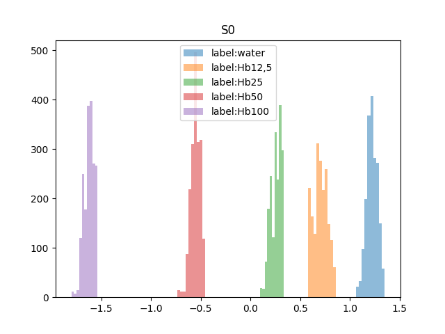
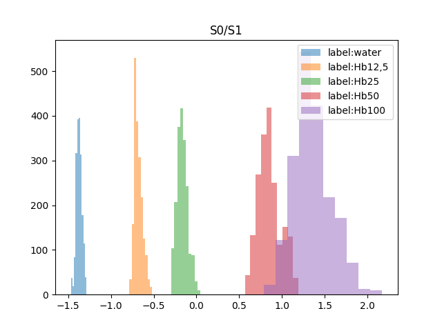
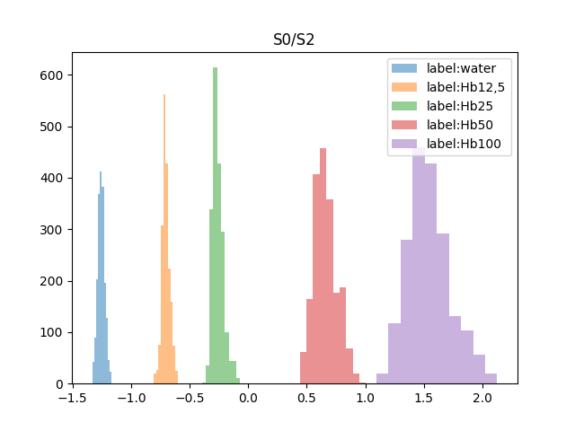
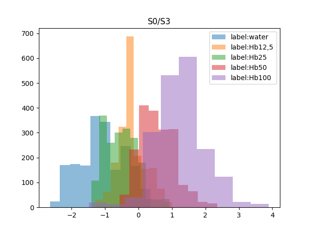
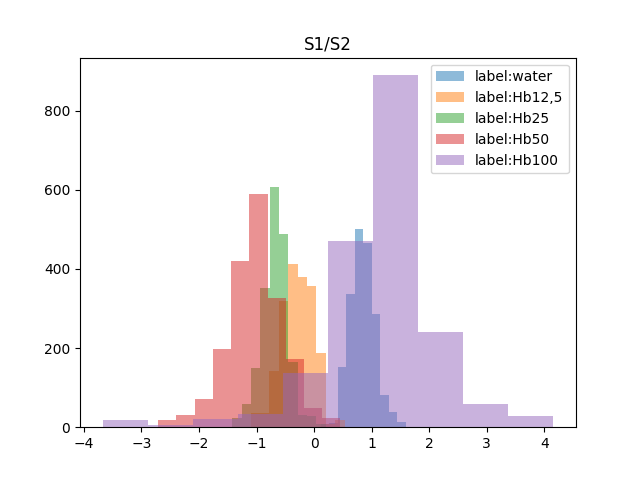
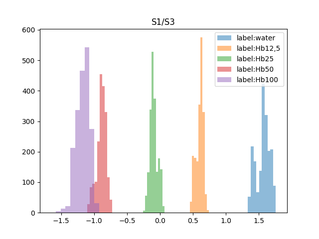
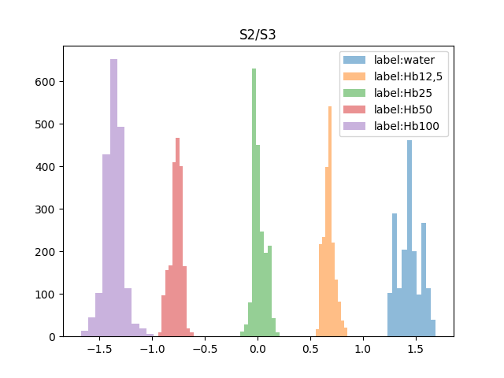
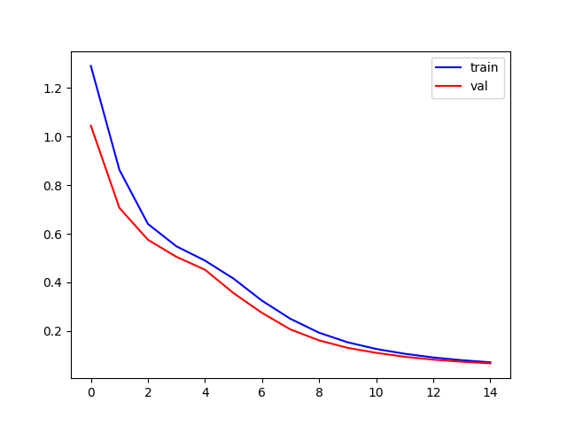

**Kansio raw** - Hb mittaukset. Vahvin konsentraatio 1mg/ml josta laimennettu 0.5mg/ml, 0.25mg/ml ja 0.125mg/ml. Lisäksi vesimittaukset.

Raakadatassa on kaikki slotit hyvin erotettavissa. Myös ovat loogisessa järjestyksessä (vesi toisessa reunassa ja voimakkain konsentraatio toisessa reunassa, muut vahvuudet jäjestyksessä niiden välissä)

Myös jotkut synteettiset featuret ovat kohtalaisen hyvin eroteltavissa, toiset taas menee päälekkäin.

  
   
  

  
   
  

**dnn1.py** - Luokittelu DNN, labelit 0-4, jossa 0 on vesi ja 4 Hb100. Päästään val_acc 1,0 tasoon 15 epochilla. Koulutuksessa käytetty 6 synteettista featurea (kts edellä olevat kuvat). Koulutettu malii tallennettu nimellä 'malli1.keras'.

Koulutuskäyrässä menee training ja valuaatio käyrät tutun tapaan käsikädessä loppuun asti:

**dnn2.py** - Regressio DNN. Koulutuksessa käytetty konsentraatiota Hb0 (=vesi), Hb12.5 ja Hb100 (vahvuudet 25 ja 50 jätetty pois). Malli tallennettu nimellä 'malli2.keras'. Antaa arvon väliltä 0-100 (=mitä luulee olevan liuoksen konsentraatio).

**dnn3.py** - Luokittelu DNN joka ennustaa onko mittaus tehty purkilla A vai B. Optimaaliseen verkkorakenteen löytämiseen käytin KerasTuneria, paras tulos saadaan 5 kerroksella jossa jokaisessa 20 neuronia. Ottaen huomioon että labeleita on vaan kaksi niin todennäköisesti neuroverkko on löytänyt vaan kohinaa eikä purkilla ole ollut vaikutusta mittaustulokseen. Myös opiskelukäyrässä alkaa n 60 epochin kohdalla tapahtumaan ylioppimista. Malli tallennettu nimellä 'malli3.keras'.

**inference.py** - printaa kolmen edellä olevan mallin veikkaukset.