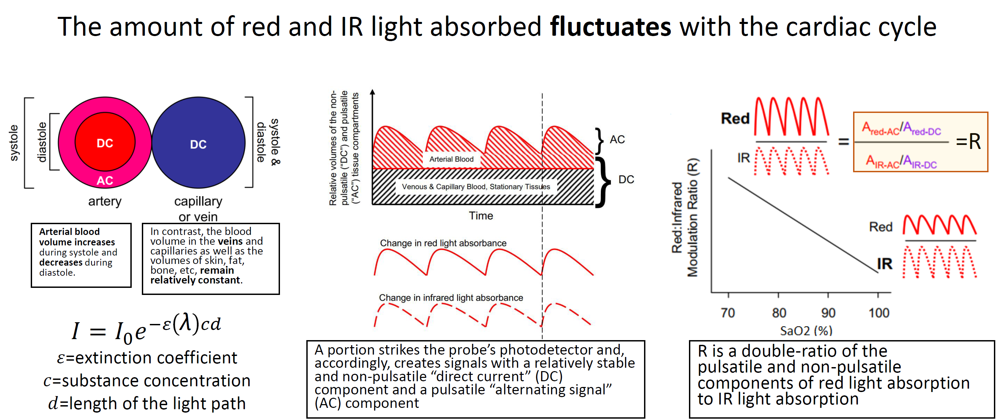
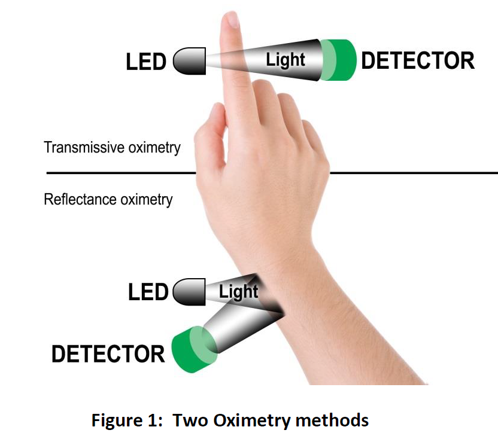
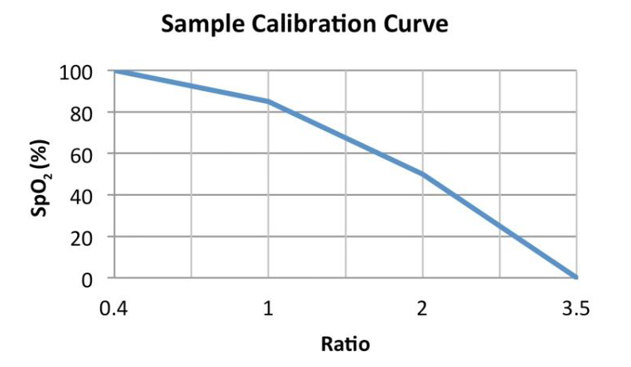
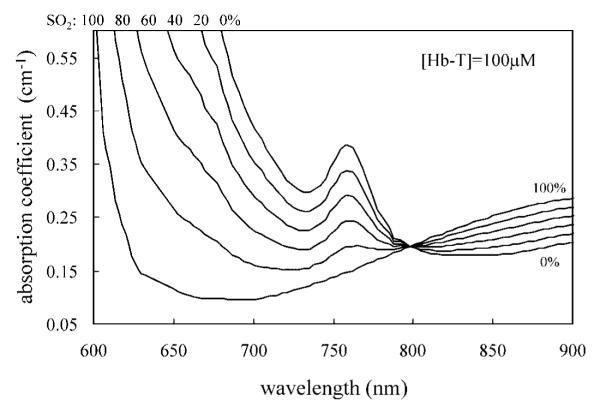
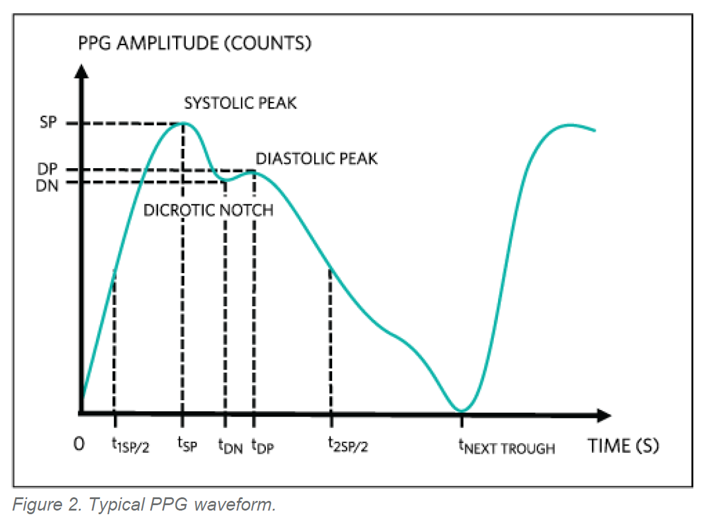
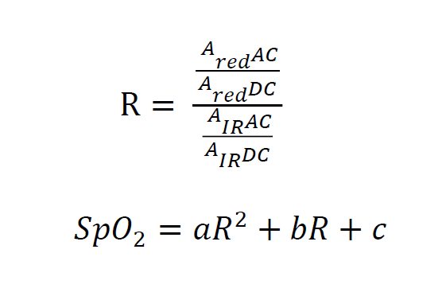
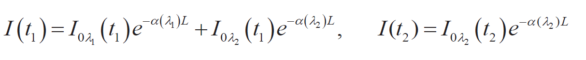
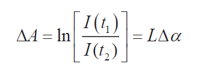

##Alla valikoima artikkeleista joita olen läpi käynyt. Jokaisesta lähteestä olen tuonut esiin pointteja joilla voisi olla vaikutusta meiden tekemiseen. Tietopalat ovat annotoituina (Lähde, Yleinen, Valonlähde, Sensori, Mittaus, Analyysi) riippuen aluetta mitä koskee.

##**[Fundamentals of Pulse Oximetry](https://www.docenti.unina.it/webdocenti-be/allegati/materiale-didattico/34096486)**

**@Yleinen**

Alla oleva kuva vetää aika hyvin yhteen sen mitä yritetään mitata. 

##**[Measuring Heart Rate and Blood Oxygen Levels for Portable and Wearable Devices](https://www.google.com/url?sa=t&rct=j&q=&esrc=s&source=web&cd=&ved=2ahUKEwjosN7yi4iRAxULT1UIHffbIVsQFnoECBcQAQ&url=https%3A%2F%2Fwww.digikey.com%2FSite%2FGlobal%2FLayouts%2FDownloadPdf.ashx%3FpdfUrl%3DBE60CF3D30E74A0C93FBFA7167A0AF07&usg=AOvVaw3tPO0B5ye7d8fulc4z13-5&opi=89978449microchip-measuring-heart-rate)**

**@Yleinen**

Alla eroavaisuus SENNO laitteen (reflektiivinen menetelmä) ja meidän käytössä olevan oksimetrin (transmissiivinen menetelmä) toimintaperiaatteiden välillä.

**@Analyysi**

Jokaisella laitteella on oma kalibrointikäyrä, joka on saatu monien mittauksien perusteella koehenkilöiden eri SpO2 tasoilla. Alla kalibrointikäyrän esimerkki.

##**[Measuring the Oxygen Content of Blood with LEDs](https://www.led-professional.com/products/featured/measuring-the-oxygen-content-of-blood-with-leds)**

**@Yleinen**

Pulse oximetry is a non-invasive method for determining haemoglobin (Hb) saturation through oxygen in the blood and heart frequency. It uses the fact that oxygen-rich and oxygen-poor haemoglobin absorb red and infrared light differently.

HbO2 absorbs more infrared light and less red light than Hb. Due to the higher reflection of red light it appears bright red. By contrast, Hb absorbs more red light and thus appears darker.

It is possible to detect the oxygen content only of arterial blood. This is based on the fact that the amount of absorbed red and infrared light varies with every heartbeat due to the pulsating changes in blood volume. By contrast, veins, bones and tissue show relative constant absorption characteristics.

**@Valolähde**

LED 150224SS73100 is characterized by an exact wavelength of 652 nm and high efficiency. With a current of IF=20mA a typical luminous intensity of 130 mcd is achieved.

In order to obtain a good signal-to-noise ratio with the IR LED as well, it should have about twice the luminous intensity of the red LED in this application.

**@Sensori**

Although the component has the highest light sensitivity at a wavelength of 940 nm, it also detects light signals with a wavelength of 660 nm. Therefore, only one single phototransistor is needed for the measurement.

##**[Near-infrared spiroximetry: noninvasive measurements of venous saturation in piglets and human subjects](https://pmc.ncbi.nlm.nih.gov/articles/PMC3786737)**

**@Lähde**

Tässä tutkimuksessa yritetiin spektofotometrin avulla porsaan ja ihmisen reidesta mitata kohdehenkilön laskimoveren saturaatiota (tämä on hankalampi mitä valtimoveren saturaation mittaaminen). Hengitysliike luo "pumpun" jonka ansiosta laskimoveri vedetään periferiasta kohti sydäntä. Lasimoissa olevien läppien takia tämä efekti korostuu sisäänheingityksellä. Em syklisyyttä käytetiin hyväksi erottelemaan laskimokompponenttia loppumittauksesta.

**@Yleinen**

The possibility of using light to measure the oxygen saturation of hemoglobin in vivo has been explored since the 1940s.

Near-infrared light in the wavelength range from 700 to 900 nm results in a sufficient penetration depth for the noninvasive optical monitoring of skeletal muscle, cerebral gray matter, and breast tissue. As a result, near-infrared techniques allow a noninvasive assessment of hemoglobin saturation for a wide range of applications, such as the study of muscle metabolism (7, 9, 12, 29, 45), the diagnosis of vascular disorders (2, 20, 32, 33, 44, 49), functional brain imaging (3, 10, 24, 30, 35, 50), and breast cancer detection (23, 28, 40, 42, 46).

**@Mittaus**

Kuvassa näkyy eri saturaatioilla (So2) olevan veren valon absorptioprofiilit aallonpituuden funktiona.

**@Analyysi**

Todellisuudessa mitataan kudoksen saturaatiota StO2 (t kuten tissue. Valo kulkee läpi/heijastuu ihosta, sidekudoksesta, rasvasta, vaskulaariverkostosta, laskimoista, valtimoista, lihaksista, luista). Tästä kaikesta on mahdollista isoloida arteriaalisen verenkierron osuutta johtuen sen kontribuution vaihtelusta mittaustulokseen systoolisen-diastoolisen faasin myötä (suomeksi sanoen pulssi).

Laskimoveren saturaationmittaria ei ole nykyhetkellä saatavilla (johtuu siitä että laskimoveresta heijastuva valo imitoi lihaksia ja muuta ympäröivä kudosta, siksi Sv02 ei ole mahdollista erottaa loppumittauksessa muista komponenteista).

##**[Comparative assessment of healthy tissue oxygenation using near-infrared imaging, transcutaneous oxygen measurement, and plethysmography](https://www.nature.com/articles/s41598-025-15767-2)**

**@Lähde**

Tissue oxygenation was measured using devices: spatial frequency domain imaging (SFDI), transcutaneous oxygen measurement (TCOM), wearable photoplethysmography (WD), and pulse oximetry (PO) during baseline, ischemia, and reperfusion phases. 
Among the four devices, SFDI uniquely detected significant differences in tissue oxygen saturation (StO2), highlighting its sensitivity to tissue heterogeneity. PO and WD data showed moderate correlation (r = 0.44–0.59); SFDI and TCOM demonstrated fair correlation (r = 0.23–0.36). 
(SFDI on kamerantyylinen laite, kuvaa esim koko käsiterän.)

**@Yleinen**

[Taulukko jossa erilaisia menetelmiä saturaatioon mittaamiseen] (https://www.nature.com/articles/s41598-025-15767-2/tables/1)
Oksimetrissa käyettävä 660nm ja 940nm valo yltää 1.5-5mm syvyydelle kudokseen.

SFDI uses the Monte-Carlo algorithm during simulation of light-tissue interactions (Kyseessä on kultainen standardi valon ja biologisen kudoksen interaktion simuloimisessa, enemmän tietoa https://link.springer.com/article/10.1007/s13534-019-00123-x mutta vaatii institutionaalista kirjautimista, ilmeisesti OAMK verkon kautta onnistuu?).

**@Valonlähde**

Wearable Device käyttää aallonpituuksia (660 nm, 525 nm, and 850 nm)

**@Mittaus**

PO also exhibits latency in detecting SpO2. Johtuu siitä että otetaan 8sek keskiarvo. Jollain laitteilla latenssi saattaa olla jopa 20sek.

Tutkimuksessa käytettiin oksimetria jolla mittaustiheys oli 64Hz, Wearable Devicella 1Hz. WD malli ei selvinnyt.

**@Analyysi**

Pulse Oximeter ja Wearable device tulokset olivat parhaimillaan 0,59 korrelaatiossa, johtuu todennäköisesti siitä että PO on transmissive (valo kulkee sormesta läpi) ja WD on reflektiivinen. Siltikin PO ja WD korrelaatio oli paras muihin tutkituihin menetelmiin verrattuna. (Löytyisikö joltakin pulssikello joka antaisi myös saturaation, olisi hyvä vertailla tulosta SENNO laitteella.)

Kun verenvuoto estetään (painetaan valtimo mekaanisesti kiinni) niin verenkierron palautuminen tapahtuu miehillä ja naisilla on eri tavalla (naisilla saturaatio palautuu nopeammin johtuen miesten herkkyydestä noradrenaliinille sen verisuonia supistavan vaikutuksen vuoksi).

##**[Using reflectometryf ora PPG waveform](https://www.analog.com/media/en/technical-documentation/design-notes/using-reflectometry-for-a-ppg-waveform.pdf)**

**@Mittaus**

Green light is readily absorbed by our bodies, so focusing on green light mitigates any contamination from reflected ambient light. However, because of the strong absorption, the depth of penetration is also limited, so it is suitable only to areas where blood perfusion is plentiful.

Indoor lights typically possess a flicker that tracks the powerline frequency (i.e., 50Hz or 60Hz, depending on location) that can obscure information carried in the AC (mitattavan valon alternoiva komponentti) component of a PPG signal.

**@Analyysi**

The time delay between the systolic and diastolic peaks shortens with the subject’s age and, given the subject’s height, provides an indicator for large artery stiffness. Both of these indicators could inform a subject’s cardiovascular health. kts alla oleva kuva,

##**[Eveliina Seppälä progradu jatkuva-aikainen vitaalitoimintojen monitorointi](https://oulurepo.oulu.fi/handle/10024/14980)**

**@Analyysi**

Alla kaava jolla intensiteettisuhteesta R lasketaan saturaatio. vakiot a, b ja c ovat laitevalmistajan antamia kertomia (tässä tapauksessa a=1.5958422, b=-34.6596622 ja c=112.6898759)

##**[Developing a device for monitoring saturation in blood](https://watermark02.silverchair.com/201_1_online.pdf?token=AQECAHi208BE49Ooan9kkhW_Ercy7Dm3ZL_9Cf3qfKAc485ysgAABZ0wggWZBgkqhkiG9w0BBwagggWKMIIFhgIBADCCBX8GCSqGSIb3DQEHATAeBglghkgBZQMEAS4wEQQMdXBqwikEtrKfJlq7AgEQgIIFUFwrlAMvGDF_nuMmERH4C3ne_HrDGSsVYLXhXDEw0fCq5vXOK_uwSLVu3kMzrtfVTTc_EoiYMvCnXY0MiIc4TogRyH9kn7EYHK7gP4KicJiI_15WpiZ66RFudNk1_WFjLBy6IxGBaAA-innlErbLCYZUJhesnXddM9dCyca6-4vyzqQNs8rx17LgLyu3xpmu0-VTYdi5XpAB4ELouyImonf1zd-wrHzh83E7S_gap0u9cvA_Ujtg1SLZVXoTMw2KxMeCvrqe-nMFqbjJtbyI7rGdGP1t8kbC1CTRBgbmqGgc4zeDUXqTgqUdiJ2TAFh_eb-b2WxQ1MtR9RObpIMApp91ljgV1dNTrs3p7Qr5fe8UZVwLLhsoHRVmLJTgJxLTLjsT7msr-g8QZljFaeM05sZd2trpmz_qju7JoTFXxU9H_yJ_zpkPnPKWaqrxE6TNIv16pnpVsoHN-R53Gpz2neQpLm3ohqxeiOx9WGKqpDJzf73P8T273UF58OLrFMWafzA6rHqGDaOKsKx3P6ZgwtaRvLxlz4ROZ4TmhzjaipDymU-_W88094jdFuMsKX3UhZH5MpB54-Ts6qBRETAkKaiBpfgylSOGRQyLH59sU4XuKNSe6KhdQkdn82yPF7wwMRtDCgoIF4t5mGgDS3j4jjlRzftQepsWcvGAq-in2ctPKA22CTUBWA-R4QB7SDAT-GR_EXgoSbJOqP6Wf77RmmHKfNN-DI2foHutA2OfiAkSS01u_116AnDdhZU21F96ACbTc526ATnhM8olYhRzHGNHW0k755_AaLao5e9Rl55ndf4YM7ISipEn1ywMdl9jNT0WmYVbBV1pGadS-hklelDE7O4_o1PlLdRgr-8d2Ni5-X4a1YMBk3qtjePlS49d4oclxy8G_zo_81Ni6UIVr04o6YbUZe6fl_hYEVfwMWrLJLpsNeVydYF5QF6ilYW6G7ZJDcoIZyjAhYji2Wkp4xNo0S0fKhzJEzoUy4dkXZiPlTpjErUkIpibLleAzrPJR6ITFPANrfy0PaEyBNrFLAHJ4b2WUjdHBt8pS1hjeKjcf8k3PUaCvDdtSbVSMCeSusiOkyPBz-8z8UtS8xkuBpCtmnuMg67d_bEI1VzsMQ68r-3UzGJkL-yGk1RbFxe2wwXqLrYt8mbfND5bMkF6KDNrqoki64CYQeoowGw4yAQfTqSrPwikePK7jT-YHIiFa8dpHeDKNyY1tKII9ulnEl9dmweS5xIruO07t8VYQLmsKLhDmXz6LL-Tnzb7qeYlxMn8JFGj2e-jw2OTTL8Gf4JFsG6dF5aUkt0pq1lShx7DcEogHDKmjlkZXvy_n-ffbVVxusySxr4pit_jFcjLB3G-DVX58mVNCjgbxqiIMGA9D33Ijcs7PpJ5aU4mBT1hXYY_HRxAJEDXYCwdYr9zOau-3EK6HGp_nYupsQEve1Dc-yCCgYZ81sXTYNcv9Vb_MnVoSy5GdlukiZGFERA0G8OY0gNDq6WwVpCMD19j87e5scg7DC8C71Z05jzLBy0wsAZYcLOfTK6dymE20ycrjJCBe1P1nvQ0--vuWmsNyrb1Kaul_cVmMbbMXCtTJkBIrLbWOPHjUIqh21u9-uAoDecpkCO_TNBET3iF9iNWuO5eqOHtakQFiiKruFGvl15Yw6g9T4f4ar5l8AJ_PQ4XQupzbenrmPJPyy-yj1BvuzrGb2UEfoOaNoq6ErUcfTu6tlKA6syyFPUmqWkooGInzNiZGWp2CyLEj-X_kW6NzlX_0tfIucqtMbKIT8-VucPUcOPTH77m_irn4jcehHB5pJw)**

**@Valonlähde**

Käytettiin kahta ledia, 632nm ja 940nm.
632nm ledi oli jatkuvasti päällä ja 940ledi oli päällä 20% ajasta. (Pulses from IR source illuminate the tissue with a frequency of 10 Hz with a 20 % fill factor)
Jatkuvasti päällä oleva ledin valo antoi informaatiota pulssista (eli pulssin saisi mitattua vaan yhdellä ledillä?)
Molempia ledejä käytettiin saturaation määrittämisessä. 

**@Sensori**

Tässä Käytettiin sensoria joka pystyi havaitsemaan aallonpituuksia 350-1100nm (malli FDS100)

**@Analyysi**

Alla kaava jolla laskettiin eri ajankohtina (t1 ja t2) valon intensiteetti. λ1 on 632nm ledi joka on jatkuvasti päällä ja λ2 on 940ledi joka pulsoi.

Kaava jolla laskettiin ajassa tapahtuvaa valon absorption muutoksia (tämä siis vaihtelee pulssin mukaan). Kaavassa I on intensity, L on valon kuljettu matka, ja alfa on kudoksen vakio.

